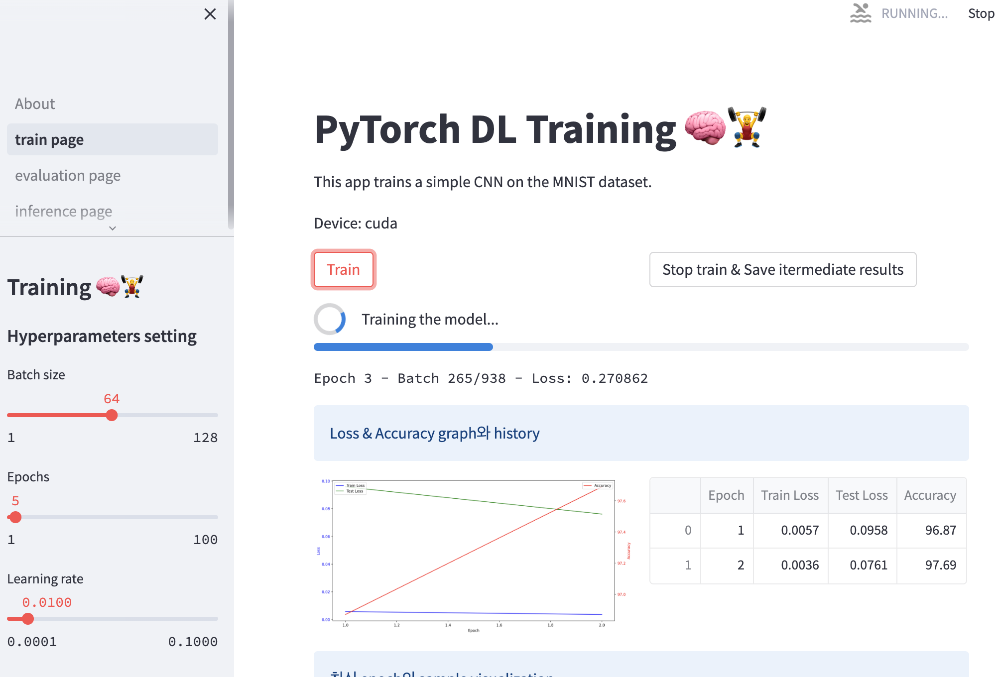

# Streamlit_MNIST_torch
Implementation of MNIST deep-learning training using streamlit

| About page | Train page |
|----------|-------------------------------------------|
|  |  |

## Install
```bash
pip install streamlit
pip install torch
```

## Run
```bash
# streamlit run About.py --server.port {YOUR PORT}
streamlit run About.py  # Default port 8501
```
